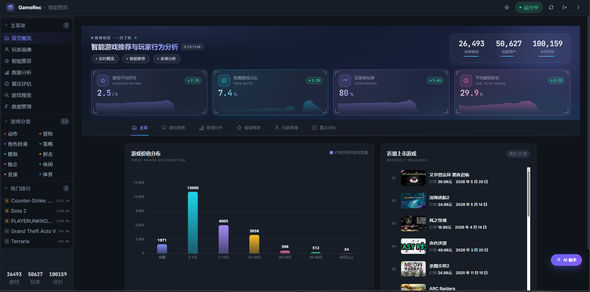
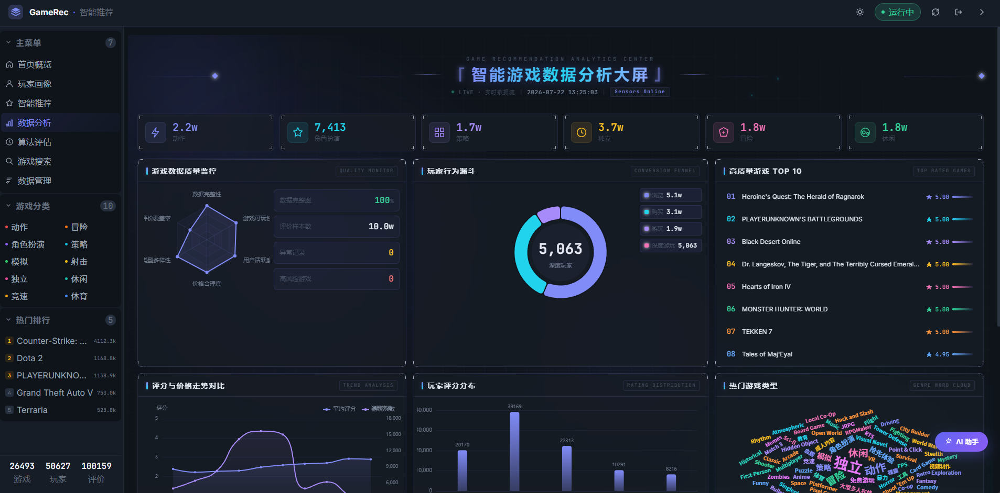
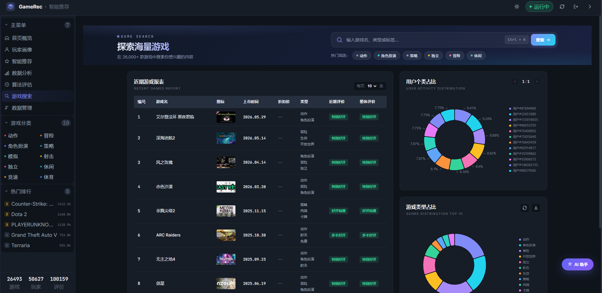
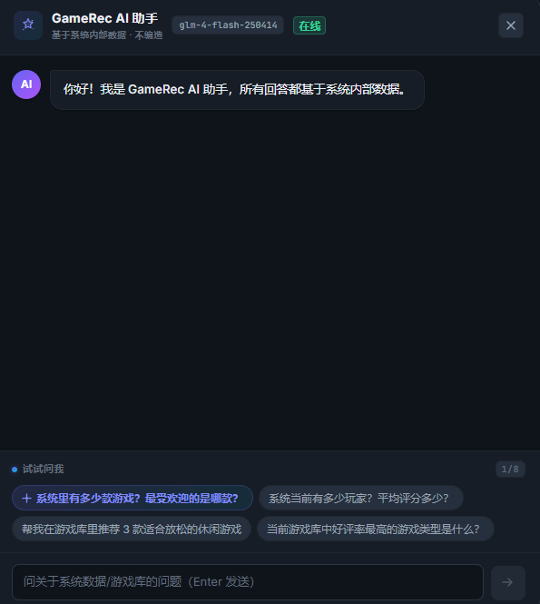

# GameRec - 智能游戏推荐与玩家行为分析系统

基于 Spring Boot + Vue 的游戏推荐与数据分析平台，集成多种推荐算法与 AI 智能问答。


## 功能特性

- **首页概览**：核心指标看板（游戏数、玩家数、评价数），价格分布、近期游戏排行
- **智能推荐**：融合 User-CF、Item-CF、SVD、内容推荐、热门推荐等多种算法
- **玩家画像**：基于用户行为数据构建兴趣画像与行为分析
- **数据分析大屏**：数据质量监控、玩家行为漏斗、评分分布、类型词云
- **游戏搜索**：多维度筛选与搜索，支持类型标签快速过滤
- **AI 助手**：集成大语言模型（智谱 GLM-4-Flash），自然语言查询系统数据
- **算法评估**：推荐算法准确率、召回率等指标评估

## 技术栈

### 后端
- Java 8+ / Spring Boot 2.7
- MyBatis-Plus 3.5
- MySQL 8.0
- Maven

### 前端
- Vue 2 + Vue Router
- Element UI
- ECharts 数据可视化
- Axios HTTP 客户端

### AI 集成
- 智谱 BigModel GLM-4-Flash（免费模型，需自行申请 API Key）

## 项目结构

```
GameRec/
├── game-recommend-system/          # 后端 Spring Boot 服务
│   ├── src/main/java/com/gamerec/gamerecommend/
│   │   ├── ai/                     # AI 对话服务
│   │   ├── config/                 # 配置类
│   │   ├── controller/             # REST 控制器
│   │   ├── entity/                 # 数据实体
│   │   ├── mapper/                 # MyBatis Mapper
│   │   ├── service/                # 业务逻辑（推荐算法等）
│   │   └── util/                   # 工具类
│   └── src/main/resources/
│       ├── application.yml         # 应用配置
│       └── mapper/                 # MyBatis XML 映射
│
├── game-recommend-frontend/        # 前端 Vue 应用
│   └── src/
│       ├── api/                    # API 接口封装
│       ├── components/              # 公共组件
│       ├── views/                   # 页面视图
│       ├── router/                   # 路由配置
│       ├── styles/                   # 样式文件
│       └── utils/                   # 工具函数
│
├── sql/                            # 数据库脚本
│   ├── 01_create_database.sql      # 建库建表 DDL
│   ├── 02_optimize_indexes.sql     # 索引优化
│   └── 04_add_ai_settings.sql      # AI 配置表
│
├── .env.example                    # 环境变量示例
├── .gitignore
└── SETUP.md                        # 详细部署指南
```

## 快速开始

### 环境要求

| 组件 | 版本 |
|------|------|
| JDK | 8+ |
| Node.js | 16+ |
| MySQL | 8.0+ |
| Maven | 3.6+ |

### 1. 克隆项目

```bash
git clone https://github.com/Y1340927/GameRec.git
cd GameRec
```

### 2. 初始化数据库

```bash
# 创建数据库
mysql -u root -p < sql/01_create_database.sql
# 可选：添加索引和 AI 配置表
mysql -u root -p game_recommend_db < sql/02_optimize_indexes.sql
mysql -u root -p game_recommend_db < sql/04_add_ai_settings.sql
```

### 3. 配置环境变量

```bash
cp .env.example .env
# 编辑 .env 填入你的数据库密码等配置
```

或直接在启动时设置环境变量：

```bash
export DB_PASSWORD=your_password
export AI_API_KEY=your_bigmodel_api_key  # 可选，AI 功能需要
```

### 4. 启动后端

```bash
cd game-recommend-system
mvn spring-boot:run
```

后端默认运行在 http://localhost:8080

### 5. 启动前端

```bash
cd game-recommend-frontend
npm install
npm run serve
```

前端默认运行在 http://localhost:8081

## 推荐算法说明

系统实现了以下推荐算法，支持混合策略：

| 算法 | 说明 |
|------|------|
| UserCF | 基于用户的协同过滤 |
| ItemCF | 基于物品的协同过滤 |
| SVD | 矩阵分解推荐 |
| ContentBased | 基于内容的推荐（游戏标签/类型） |
| Popularity | 热门游戏推荐 |
| Hybrid | 混合推荐（融合多种算法） |

## AI 助手配置

1. 前往 [智谱 BigModel](https://open.bigmodel.cn/) 注册并获取 API Key
2. 启动系统后，在「系统设置 → AI 设置」页面填入 API Key
3. 或通过环境变量 `AI_API_KEY` 注入

## 界面预览

### 首页概览


### 数据分析大屏


### 游戏搜索


### AI 助手


## License

MIT
